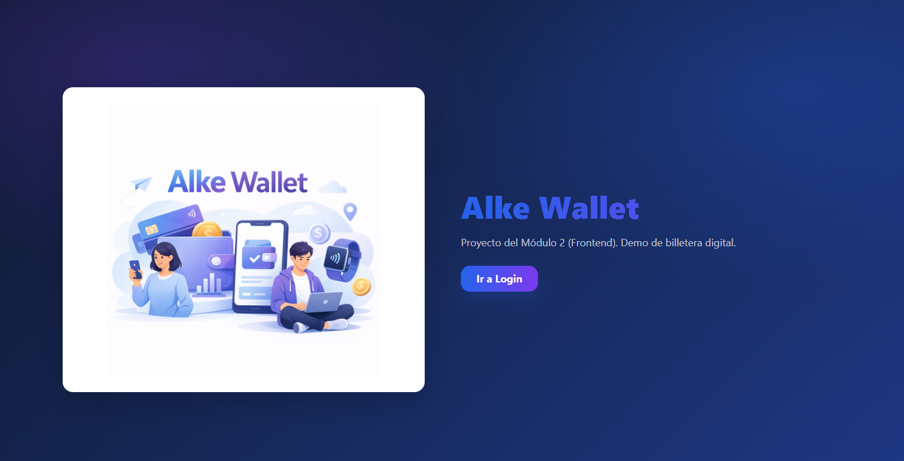
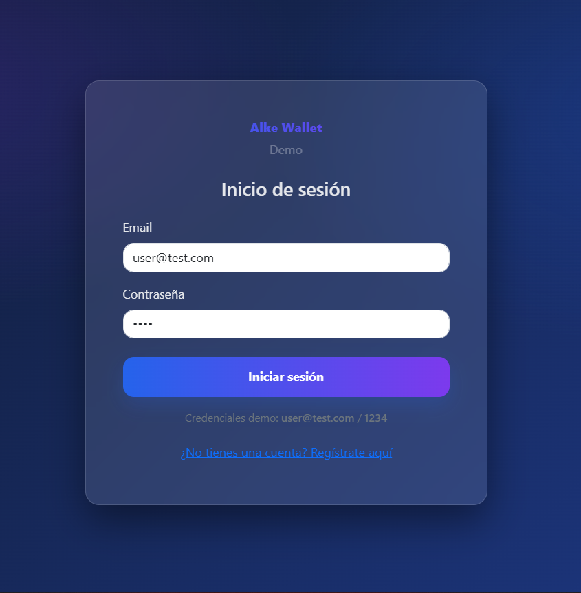
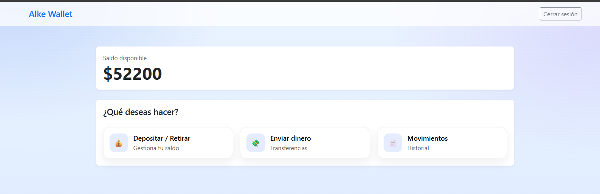
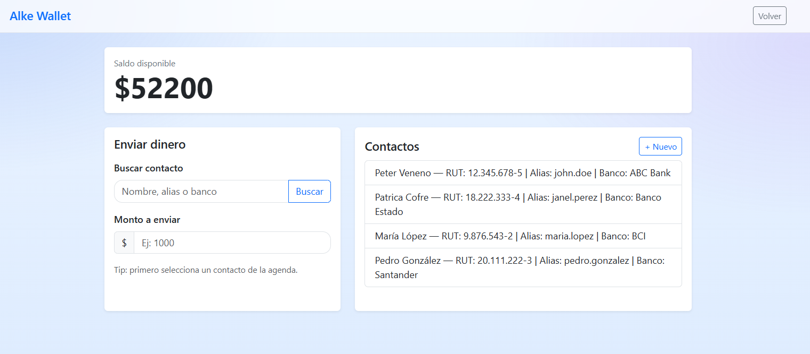
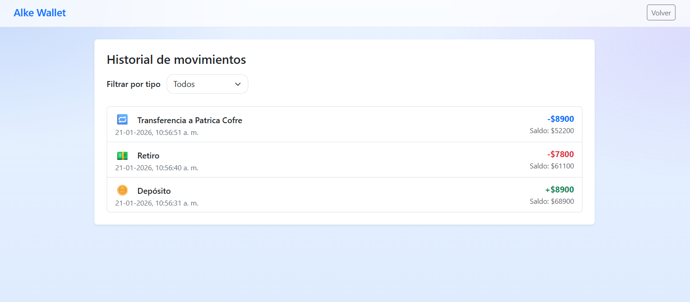

# 📱 Alke Wallet — Aplicación Demo (Frontend)

<p align="center">
  
</p>


**Alke Wallet** es una aplicación web **demo** que simula una billetera digital. Permite **iniciar sesión**, **registrar usuarios**, **depositar**, **enviar dinero a contactos** y **revisar movimientos**, todo sin backend real (persistencia en `localStorage`).

---

## 🚀 Funcionalidades
- ✅ **Inicio de sesión** con credenciales demo y/o usuarios registrados.
- ✅ **Registro de usuario** (email + contraseña).
- ✅ **Depósitos / Retiros** con validaciones de saldo.
- ✅ **Envío de dinero** a contactos (selección + búsqueda/autocompletado).
- ✅ **Historial de transacciones** (depósitos, retiros y transferencias).
- ✅ Persistencia de datos en **localStorage**.

---

## 📸 Capturas

<p align="center">
  <b>Inicio (mobile)</b><br>
  <a href="assets/screenshots/index-mobile.png">
    
  </a>
</p>

<table>
  <tr>
    <td align="center" valign="top">
      <b>Login</b><br>
      <a href="assets/screenshots/login.png">
        
      </a>
    </td>
    <td align="center" valign="top">
      <b>Menú</b><br>
      <a href="assets/screenshots/menu.png">
        
      </a>
    </td>
  </tr>
  <tr>
    <td align="center" valign="top">
      <b>Enviar dinero</b><br>
      <a href="assets/screenshots/sendmoney.png">
        
      </a>
    </td>
    <td align="center" valign="top">
      <b>Movimientos</b><br>
      <a href="assets/screenshots/transactions.png">
        
      </a>
    </td>
  </tr>
</table>

<p align="center"><i>Tip: toca cualquier imagen para verla en grande.</i></p>

---

## 🧩 Tecnologías
- **HTML + CSS** (estilos personalizados)
- **JavaScript (ES6)** (lógica de negocio y DOM)
- **Bootstrap 5** (layout responsive)
- **jQuery 3.7.1** (eventos y helpers)

> **Backend:** No existe backend. Todo se simula en cliente usando `localStorage`.

---

## 🛠️ Instalación / Ejecución local

1. **Clonar el repositorio**
   ```bash
   git clone https://github.com/tu-usuario/alke-wallet.git
   ```
2. **Abrir el proyecto**
   - Recomendado: usar **Live Server** (VS Code).
   - Abrir `index.html`.

---

## 🔑 Credenciales de acceso

### Usuario Demo
- **Email:** `user@test.com`
- **Contraseña:** `1234`

> También puedes crear un usuario nuevo desde el link de registro en `login.html`.

---

## 🗂️ Estructura del proyecto (referencial)

```txt
/
├─ index.html
├─ HTML/
│  ├─ login.html
│  ├─ menu.html
│  ├─ deposit.html
│  ├─ sendmoney.html
│  └─ transactions.html
├─ CSS/
│  └─ styles.css
├─ JS/
│  └─ app.js
└─ assets/
   ├─ img/
   │  └─ Wallet1.png
   └─ screenshots/
      ├─ index-mobile.png
      ├─ login.png
      ├─ menu.png
      ├─ sendmoney.png
      └─ transactions.png
```

---

## 💾 Datos guardados (localStorage)

La app guarda información en `localStorage`, por ejemplo:
- Estado de sesión (`loggedIn`)
- Usuarios registrados
- Saldo
- Contactos
- Historial de transacciones
- Contacto seleccionado (para transferencias)

### 🔄 Resetear la app (volver a estado inicial)
Abre la consola del navegador y ejecuta:
```js
localStorage.clear();
location.reload();
```

---

## 🧪 Flujo de uso rápido
1. Entra a `index.html` → **Ir a Login**
2. Inicia sesión con credenciales demo o crea un usuario.
3. Deposita saldo (si aplica).
4. Ve a **Enviar dinero**, selecciona un contacto y confirma.
5. Revisa los **movimientos**.

---

## 🤝 Contribuciones
1. Haz **Fork**
2. Crea una rama: `git checkout -b feature/nueva-funcionalidad`
3. Commit: `git commit -m "Agrega X"`
4. Push: `git push origin feature/nueva-funcionalidad`
5. Abre un **Pull Request**
